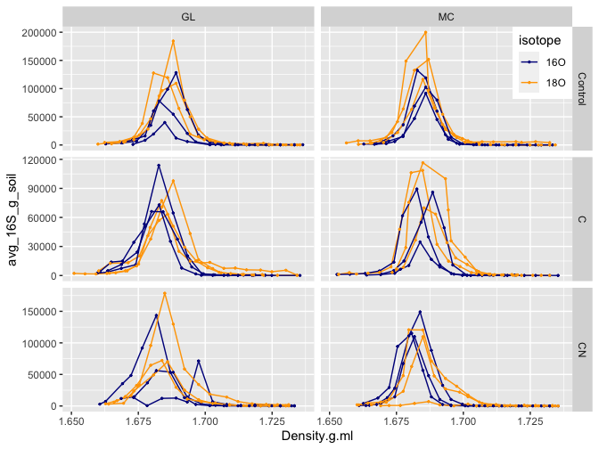
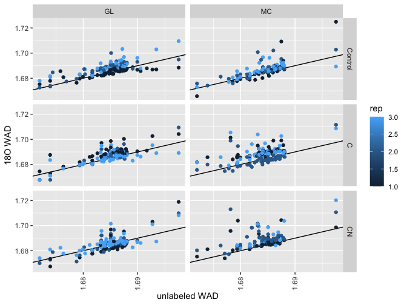

qsip Package
================
Bram Stone

- <a href="#background" id="toc-background">Background</a>
  - <a href="#terminology" id="toc-terminology">Terminology</a>
- <a href="#installation" id="toc-installation">Installation</a>
- <a href="#1-density-curves" id="toc-1-density-curves">1. Density
  curves</a>
- <a href="#2-per-taxon-densities" id="toc-2-per-taxon-densities">2.
  Per-taxon densities</a>
  - <a href="#filtering-and-relativizing-sequences"
    id="toc-filtering-and-relativizing-sequences">Filtering and relativizing
    sequences</a>
  - <a href="#setting-frequency-thresholds"
    id="toc-setting-frequency-thresholds">Setting frequency thresholds</a>
  - <a href="#calculating-per-taxon-weighted-average-densities-wads"
    id="toc-calculating-per-taxon-weighted-average-densities-wads">Calculating
    per-taxon weighted average densities (WADs)</a>
  - <a href="#unlabeled-vs-labeled-wad-values"
    id="toc-unlabeled-vs-labeled-wad-values">Unlabeled vs. labeled WAD
    values</a>
- <a href="#3-per-taxon-enrichment" id="toc-3-per-taxon-enrichment">3.
  Per-taxon enrichment</a>
- <a href="#references" id="toc-references">References</a>

<style type="text/css">
pre, code {white-space:pre !important; overflow-x:scroll !important; overflow-y: scroll !important;}
</style>

## Background

**Quantitative stable isotope probing (qSIP)** is the combination of
stable isotope probing – a foundational technique in the study of
ecosystems – with targeted amplicon sequencing data of microbial
communities. In conventional stable isotope probing (SIP) experiments,
identification of the amount of isotopic enrichment of nucleic acids was
done qualitatively – through visual i dentification and categorization
of nucleic acids into either “heavy” or “light” regions. The qSIP
approach is to divide a single sample into many different fractions
(without *a priori* categorization) along a gradient of increasing
densities, and to estimate the shift in the buoyant density of an
individual microbial taxon’s nucleic acids based on it’s abundance
across the many fractions (Hungate *et al.* 2015). Further details on
the qSIP methodology may be found in Purcell *et al.* (2019). The core
calculation produces estimates of every microbial taxon’s fractional
isotopic enrichment above background – or natural abundance – levels.
However, qSIP can also estimate population *per-capita* rates of growth
and mortality (i.e., turnover) (Koch *et al.* 2018).

Current functionality in the `qsip` package is built on the
[`data.table` package](https://rdatatable.gitlab.io/data.table/).
`data.table` can perform filtering, aggregating, merging, and reshaping
functions on large data quickly and with low computational overhead. For
initial data preparation and subsequent analyses, `data.table` is worth
learning. As such, the current version `qsip` package works with
tabular, long-form data. We note that this is a significant redirection
from previous versions of the package which had expected data organized
using the `phyloseq` format. For access to this older functionality,
please see the [`legacy`
branch](https://github.com/bramstone/qsip/tree/legacy) of this package.

The `qsip` package supports stable isotope experiments using
<sup>18</sup>O, <sup>13</sup>C, and <sup>15</sup>N (Morrissey *et al.*
2018). It is also agnostic towards the sequencing method and taxonomic
distinctions of the data. 16S, 18S, ITS, and metagenomic data can all be
utilized.

The generation of enrichment values via qSIP can typically be divided up
into three parts:

1.  Density curves (and initial data quality checking)
2.  Per-taxon densities (and quality filtering)
3.  Per-taxon enrichment calculations (and additional filtering)

### Terminology

Conducting a qSIP experiment is, in many ways, an exercise in data
organization. In an amplicon sequencing study, a single sequencing
sample is usually produced from DNA extracted from a single point of
collection. In a qSIP experiment, DNA from each sample is divided into
usually more than a dozen fractions which must all be sequenced
separately. Because of this, as well as to make this package as easy to
use as possible, consistent terminology should be applied to any qSIP
experiment.

- **Replicate** - A single physical sample that has been divided into
  multiple fractions (usually 10–20). The term *replicate* is used
  rather than *sample* to avoid confusion during the sequencing
  preparation process, in which each qSIP fraction must be treated as a
  separate sample. Furthermore, the term *replicate* makes it clear that
  these represent the unit of statistical replication and power.
- **Fraction** - A subsample produced by fractionating a single
  replicate based on vertical stratification following
  ultra-centrifugation. *Each fraction must have its own measure of
  abundance (e.g., amplicon qPCR or DNA concentration) as well as a
  density measurement.*
- **Feature Table** - Often called an OTU table, ASV table, or species
  abundance table. A table of abundances or relative frequences for each
  microbial taxon in each sample. For qSIP analyses, feature tables must
  include the abundances/frequencies in *each* fraction. For qSIP
  analyses, this should not be a binary presence-absence table.
- **Labeled** - A replicate that has been treated with a stable isotope
  (<sup>18</sup>O, <sup>13</sup>C, or <sup>15</sup>N). Often used to
  differentiate labeled from unlabeled values in output from the `qsip`
  package (as well as represented in equations throughout the published
  literature). Sometimes also called a “heavy” sample.
- **Light** - A replicate that has **not** been treated with a stable
  isotope. An unlabeled replicate.
- **Excess atom fraction (EAF)** - The fraction of an organism’s nucleic
  acids that are enriched by a stable isotope in excess of the
  background (or natural abundance) concentration. Used interchangeably
  with atom percent excess (APE) or atom fraction excess (AFE), though
  EAF is the most appropriate term (Coplen 2011).

## Installation

`qsip` is not currently on CRAN. The only way to install `qsip` is
through Github.

``` r
install.packages('data.table')
install.packages('devtools')

# install qsip using the utilities on devtools
devtools::install_github('bramstone/qsip')

library(data.table)
library(qsip)
```

## 1. Density curves

Density curves simply plot the amount of DNA, or specific sequences if
using qPCR, across all of the fractions that you have laboriously
separated your sample into following ultracentrifugation. This
exploration of the data should be done prior to sequencing to ensure
that sequencing will be successful. They serve as your initial screen of
data quality because they show whether you have created “heavier” DNA
during the course of your incubation. If you generate more samples than
you plan to sequence, you can use this step to prioritize your
sequencing efforts. However, you are more than likely using it to
determine if you need to respin and re-fractionate any of your samples.

**Necessary columns to plot density curves**

- ID column corresponding to unique replicates
- Density value of fraction **OR** fraction number
- Quantification of microbial abundance (DNA qubit, qPCR) for each
  fraction

In addition, it is usually important to have isotopic amendment and
other important experimental grouping variables as well.

For this tutorial, consider the experimental data (`exp_dat`) from an
<sup>18</sup>O addition experiment in soils from two ecosystems (`MC`
and `GL`) and under three nutrient amendments (`control`, `C`, and `CN`)
indicating un-amended soils or glucose-amended soils or glucose and
ammomium-amended soils.

``` r
exp_dat
```

    ##      sampleID fraction timepoint isotope iso_trt ecosystem treatment rep Density.g.ml avg_16S_g_soil
    ##   1:  W0_GL_1        1         0    <NA>    <NA>        GL      <NA>   1           NA         478884
    ##   2:  W0_GL_2        2         0    <NA>    <NA>        GL      <NA>   2           NA         595969
    ##   3:  W0_GL_3        3         0    <NA>    <NA>        GL      <NA>   3           NA         595900
    ##   4:  W0_GL_4        4         0    <NA>    <NA>        GL      <NA>   4           NA         350888
    ##   5:  W0_MC_1        1         0    <NA>    <NA>        MC      <NA>   1           NA         659478
    ##  ---                                                                                                
    ## 573: W1_MC_30        8         7     18O   label        MC        CN   3     1.713312            201
    ## 574: W1_MC_30       17         7     18O   label        MC        CN   3     1.672253            792
    ## 575: W1_MC_30       18         7     18O   label        MC        CN   3     1.669094            369
    ## 576: W1_MC_30        2         7     18O   label        MC        CN   3     1.735421             90
    ## 577: W1_MC_30        4         7     18O   label        MC        CN   3     1.728051             91

``` r
library(ggplot2)

ggplot(exp_dat[!is.na(Density.g.ml)],
       aes(Density.g.ml, avg_16S_g_soil, color = isotope)) +
  geom_line(aes(group = sampleID)) +
  geom_point(size = .5) +
  facet_grid(treatment ~ ecosystem, scales = 'free_y') +
  scale_color_manual(values = c('darkblue', 'orange')) +
  theme(legend.position = c(1, 1),
        legend.justification = c(1, 1))
```

<!-- -->

## 2. Per-taxon densities

Following amplicon sequencing, the resulting feature table should be
combined with experimental data (e.g., `exp_dat`) into a long-format
table. Here, each taxon in each fraction should have its own row.

With these data, per-taxon densities may be calculated.

**Necessary columns for qSIP calculations:**

- ID column corresponding to unique replicates
- ID column corresponding to each unique replicate-fraction. I’m putting
  it in *necessary* column list because you have already needed it to
  join your sequencing data (which were generated for each fraction) to
  your experimental data
- taxonomic ID column
- Density value of fraction **OR** fraction number (if using internal
  standards)
- Quantification of microbial abundance (DNA qubit, qPCR) for each
  fraction
- Sequence reads (for each taxon in each fraction). **Sequence reads
  should be as unfiltered as possible with the exception of removing
  global singleton and doubleton features**. Further, sequence reads are
  **not** normalized – that will be done after removing off-target
  sequences

**Example data format:**

``` r
data(example_qsip)

example_qsip
```

    ##         asv_id sampleID fraction timepoint isotope iso_trt ecosystem treatment rep Density.g.ml avg_16S_g_soil seq_abund  Kingdom         Phylum               Class               Order               Family                    Genus
    ##     1: ASV_112  W0_GL_1        1         0    <NA>    <NA>        GL      <NA>   1           NA         478884        69 Bacteria  Bacteroidetes         Bacteroidia     Chitinophagales     Chitinophagaceae unknown Chitinophagaceae
    ##     2:  ASV_85  W0_GL_1        1         0    <NA>    <NA>        GL      <NA>   1           NA         478884        30 Bacteria Proteobacteria Gammaproteobacteria   Enterobacteriales   Enterobacteriaceae     Escherichia-Shigella
    ##     3:  ASV_50  W0_GL_1        1         0    <NA>    <NA>        GL      <NA>   1           NA         478884        37 Bacteria Actinobacteria     Thermoleophilia Solirubrobacterales                67-14            unknown 67-14
    ##     4:  ASV_46  W0_GL_1        1         0    <NA>    <NA>        GL      <NA>   1           NA         478884        44 Bacteria Actinobacteria     Thermoleophilia Solirubrobacterales Solirubrobacteraceae             Conexibacter
    ##     5:  ASV_19  W0_GL_1        1         0    <NA>    <NA>        GL      <NA>   1           NA         478884       104 Bacteria Actinobacteria      Actinobacteria       Micrococcales       Micrococcaceae   unknown Micrococcaceae
    ##    ---                                                                                                                                                                                                                                
    ## 14383:  ASV_99 W1_MC_30       16         7     18O   label        MC        CN   3     1.676464            876        28 Bacteria  Acidobacteria          Subgroup 6  unknown Subgroup 6   unknown Subgroup 6       unknown Subgroup 6
    ## 14384:  ASV_50 W1_MC_30       11         7     18O   label        MC        CN   3     1.701731           3067        13 Bacteria Actinobacteria     Thermoleophilia Solirubrobacterales                67-14            unknown 67-14
    ## 14385:  ASV_50 W1_MC_30       14         7     18O   label        MC        CN   3     1.686992           6983        33 Bacteria Actinobacteria     Thermoleophilia Solirubrobacterales                67-14            unknown 67-14
    ## 14386:  ASV_50 W1_MC_30        6         7     18O   label        MC        CN   3     1.719629            189       203 Bacteria Actinobacteria     Thermoleophilia Solirubrobacterales                67-14            unknown 67-14
    ## 14387: ASV_115 W1_MC_30       16         7     18O   label        MC        CN   3     1.676464            876         6 Bacteria  Bacteroidetes         Bacteroidia    Flavobacteriales    Flavobacteriaceae           Flavobacterium

There are additional columns which are not strictly necessary but which
were useful in data organization. It is encouraged to create the columns
needed to effectively manage your data.

### Filtering and relativizing sequences

Depending on quantification method, and sequencing targets, sequences
should be relativized based on the relevant organisms of your study.

For example, this study quantified bacterial 16S sequences with primers
meant to exclude Eukarya and Archaea. **Therefore, relative abundances
should only reflect our target organisms.**

So in this case, we need to remove:

- Unassigned reads
- Eukarya
- Archaea
- Mitochondrial and chloroplast sequences

First, how many taxa and how many sequence reads to we have? Reviewers
typically want to know this, better to have these numbers now than have
to go digging later. `qsip` offers the `seq_summary` function which is a
small utility function which counts and automatically formats total
sequence read abundances and number of taxonomic features across the
whole data set.

``` r
# columns necessary for seq_summary
ssc <- c('seq_abund', 'asv_id')

# initial sequence and ASV count?
cat('Initial\n')
seq_summary(example_qsip[, ..ssc])

# Identify lineages to remove
tx <- unique(example_qsip[, c('asv_id', 'Kingdom', 'Phylum', 'Class', 'Order', 'Family', 'Genus')])

unassign <- tx[Kingdom == 'Unassigned', asv_id]
euk <- tx[Kingdom == 'Eukaryota', asv_id]
arch <- tx[Kingdom == 'Archaea', asv_id]
mito_chloro <- tx[, tax_string := paste(Phylum, Class, Order, Family, Genus, sep = ';')
                  ][grepl('mitochond|chloroplast', tax_string, ignore.case = T), asv_id]

cat('Unassigned\n')
seq_summary(example_qsip[asv_id %in% unassign, ..ssc])
cat('Eukarya\n')
seq_summary(example_qsip[asv_id %in% euk, ..ssc])
cat('Archaea\n')
seq_summary(example_qsip[asv_id %in% arch,..ssc])
cat('Mitochondria, Chloroplasts\n')
seq_summary(example_qsip[asv_id %in% mito_chloro, ..ssc])

# Filter out lineages
example_qsip <- example_qsip[!asv_id %in% c(arch, mito_chloro, euk, unassign)]

cat('\n\nFinal after filtering\n')
seq_summary(example_qsip[,  ..ssc])
```

    ## Initial
    ##    2,963,445 sequences
    ##          141 tax features
    ## Unassigned
    ##          166 sequences
    ##            4 tax features
    ## Eukarya
    ##           32 sequences
    ##            3 tax features
    ## Archaea
    ##      456,956 sequences
    ##            9 tax features
    ## Mitochondria, Chloroplasts
    ##          497 sequences
    ##            6 tax features
    ## 
    ## 
    ## Final after filtering
    ##    2,505,794 sequences
    ##          119 tax features

Now that off-target sequences have been removed, we can normalize our
sequences.

``` r
# normalize 16S abundances of bacteria
example_qsip[, rel_abund := seq_abund / sum(seq_abund), by = sampleID]
```

### Setting frequency thresholds

The next decision is whether to keep, or to remove rare and infrequent
lineages. There is no strong agreement among qSIP-users on whether to do
this. Rare and infrequent taxa produce noise in the data, making it hard
to discern quality.

The one guiding principle that there may be agreement on is that it’s
best to set minimum filters at first – i.e. be as inclusive as possible
– and only intensify filters as needed to reduce noise.

`qsip` offers the `freq_filter` function which allows users to remove a
taxon from a replicate if it fails to be present in the requisite number
of instances. Because the data, at this time, contain fraction-level
information, placing the sample ID column as the `filter_target` directs
the function to find out how many times an organism is present in a
given sample. It then removes organisms that occur in *fewer* fractions
than the minimum. In this example, an organism that occurs in 2 or fewer
fractions in a sample is removed.

The `filter_target` function accepts more than one column name and so
frequency may be assessed across multiple samples in a treatment group
at later stages in the analysis.

``` r
# initial sequence and ASV count?
cat('Before fraction filtering\n')
seq_summary(example_qsip[, ..ssc])

# Remove taxa that occur in fewer than 3 fractions in any given replicate
example_qsip <- freq_filter(example_qsip, 
                            min_freq = 3, 
                            filter_target = 'sampleID',
                            tax_id = 'asv_id')

cat('\nAfter fraction filtering\n')
seq_summary(example_qsip[, ..ssc])
```

    ## Before fraction filtering
    ##    2,505,794 sequences
    ##          119 tax features
    ## 
    ## After fraction filtering
    ##    2,451,069 sequences
    ##          105 tax features

### Calculating per-taxon weighted average densities (WADs)

The `calc_wad` function estimates in which fraction a taxon is most
present, and creates a sample-wide buoyant density measure weighted by
all fractions. The measure is called the *weighted average density* (or
`wad`).

The `wvd` term produced is the *weighted variance in density*,
essentially a measure of how spread-out an orgnanism’s WAD value is. It
is not strictly necessary for the qSIP calculations. It can sometimes be
useful as a diagnostic of the quality of an organism’s density estimate.

`calc_wad` also attempts to express a taxon’s sample-level abundance by
multiplying relative abundances by per-fraction total abundance. Note
that this value will be in the same terms as the abundance column – in
other words, `calc_wad` does not necessarily attempt to calculate
sample-level sequence read abundance.

It is important here to include the key grouping variables of the
experiment in the final line of the calculation.

``` r
# keep track of which columns should be kept for downstream analyses
keep_cols <- setdiff(names(example_qsip), 
                     c('asv_id', 'sampleID', 'fraction', 'Density.g.ml', 
                       'avg_16S_g_soil', 'rel_abund', 'seq_abund'))

# calculate weighted average densities
wads <- calc_wad(example_qsip,
                 tax_id = 'asv_id', sample_id = 'sampleID', frac_id = 'fraction',
                 frac_dens = 'Density.g.ml', frac_abund = 'avg_16S_g_soil',
                 rel_abund = 'rel_abund',
                 grouping_cols = keep_cols)

wads
```

    ##        asv_id sampleID timepoint isotope iso_trt ecosystem treatment rep  Kingdom            Phylum                       Class               Order               Family                     Genus      wad          wvd      abund
    ##    1: ASV_112  W1_GL_1         7     16O   light        GL   Control   1 Bacteria     Bacteroidetes                 Bacteroidia     Chitinophagales     Chitinophagaceae  unknown Chitinophagaceae 1.671803 5.878302e-05  74.387549
    ##    2:  ASV_50  W1_GL_1         7     16O   light        GL   Control   1 Bacteria    Actinobacteria             Thermoleophilia Solirubrobacterales                67-14             unknown 67-14 1.687220 3.315167e-05 116.123115
    ##    3:  ASV_46  W1_GL_1         7     16O   light        GL   Control   1 Bacteria    Actinobacteria             Thermoleophilia Solirubrobacterales Solirubrobacteraceae              Conexibacter 1.686769 4.086179e-05 121.123813
    ##    4:  ASV_19  W1_GL_1         7     16O   light        GL   Control   1 Bacteria    Actinobacteria              Actinobacteria       Micrococcales       Micrococcaceae    unknown Micrococcaceae 1.683015 3.142927e-05 367.670985
    ##    5:  ASV_42  W1_GL_1         7     16O   light        GL   Control   1 Bacteria    Actinobacteria             Thermoleophilia Solirubrobacterales                67-14             unknown 67-14 1.688763 4.023149e-05  99.666827
    ##   ---                                                                                                                                                                                                                              
    ## 1575:  ASV_93 W1_MC_30         7     18O   label        MC        CN   3 Bacteria     Acidobacteria Blastocatellia (Subgroup 4)     Pyrinomonadales     Pyrinomonadaceae                      RB41 1.684362 1.544073e-05   7.348954
    ## 1576:  ASV_59 W1_MC_30         7     18O   label        MC        CN   3 Bacteria    Proteobacteria         Alphaproteobacteria    Sphingomonadales    Sphingomonadaceae              Sphingomonas 1.687081 3.640229e-05  74.657028
    ## 1577:  ASV_21 W1_MC_30         7     18O   label        MC        CN   3 Bacteria    Actinobacteria              Actinobacteria    Streptomycetales    Streptomycetaceae              Streptomyces 1.698814 2.001558e-04  14.657296
    ## 1578: ASV_125 W1_MC_30         7     18O   label        MC        CN   3 Bacteria Entotheonellaeota              Entotheonellia    Entotheonellales    Entotheonellaceae unknown Entotheonellaceae 1.683879 1.145556e-05   6.169604
    ## 1579:  ASV_50 W1_MC_30         7     18O   label        MC        CN   3 Bacteria    Actinobacteria             Thermoleophilia Solirubrobacterales                67-14             unknown 67-14 1.692952 1.249284e-04   5.186541

### Unlabeled vs. labeled WAD values

The easiest way to look at the change in WAD values for each taxon is to
make unlabeled WADs and labeled WADs into separate columns. In other
words this is a transformation to wide-format. This operation can be
carried out by the `wad_wide` function. Because each WAD value is
specific to a single sample, the unlabeled WAD values are averaged by
default (but this action can be suppressed by indicating
`average_light = F`).

``` r
# transform to wide format
ww <- wad_wide(wads, 
               tax_id = 'asv_id', 
               sample_id = 'sampleID',
               iso_trt = 'iso_trt', 
               isotope = 'isotope')

ww

# plot light and heavy WADs for each isotope
ggplot(ww, aes(light, label, color = rep)) + 
  geom_abline(intercept = 0, slope = 1) + 
  ylab('18O WAD') + 
  xlab('unlabeled WAD') +
  geom_point() + 
  facet_grid(treatment ~ ecosystem) +
  theme(axis.text.x = element_text(angle = 90, vjust = .5))
```

<!-- -->

    ##        asv_id sampleID timepoint isotope ecosystem treatment rep  Kingdom        Phylum      Class              Order             Family              Genus          wvd      abund    light    label
    ##    1: ASV_100  W1_GL_1         7     16O        GL   Control   1 Bacteria Acidobacteria Subgroup 6 unknown Subgroup 6 unknown Subgroup 6 unknown Subgroup 6 2.927342e-05  37.015935 1.685114       NA
    ##    2: ASV_100 W1_GL_20         7     18O        GL   Control   2 Bacteria Acidobacteria Subgroup 6 unknown Subgroup 6 unknown Subgroup 6 unknown Subgroup 6 9.208054e-06   4.530371 1.685114 1.700065
    ##    3: ASV_100 W1_GL_24         7     18O        GL         C   3 Bacteria Acidobacteria Subgroup 6 unknown Subgroup 6 unknown Subgroup 6 unknown Subgroup 6 1.116179e-04   7.835347 1.685114 1.695497
    ##    4: ASV_100  W1_GL_3         7     16O        GL   Control   3 Bacteria Acidobacteria Subgroup 6 unknown Subgroup 6 unknown Subgroup 6 unknown Subgroup 6 1.183781e-05  39.459112 1.685114       NA
    ##    5: ASV_100 W1_GL_30         7     18O        GL        CN   3 Bacteria Acidobacteria Subgroup 6 unknown Subgroup 6 unknown Subgroup 6 unknown Subgroup 6 4.246753e-05  81.654466 1.685114 1.683799
    ##   ---                                                                                                                                                                                                
    ## 1575:  ASV_99  W1_GL_4         7     16O        GL         C   1 Bacteria Acidobacteria Subgroup 6 unknown Subgroup 6 unknown Subgroup 6 unknown Subgroup 6 8.480547e-06 315.704881 1.683770       NA
    ## 1576:  ASV_99  W1_GL_6         7     16O        GL         C   3 Bacteria Acidobacteria Subgroup 6 unknown Subgroup 6 unknown Subgroup 6 unknown Subgroup 6 1.410368e-05 172.575368 1.683770       NA
    ## 1577:  ASV_99 W1_MC_20         7     18O        MC   Control   2 Bacteria Acidobacteria Subgroup 6 unknown Subgroup 6 unknown Subgroup 6 unknown Subgroup 6 8.978254e-05  11.168919 1.683770 1.694727
    ## 1578:  ASV_99 W1_MC_23         7     18O        MC         C   2 Bacteria Acidobacteria Subgroup 6 unknown Subgroup 6 unknown Subgroup 6 unknown Subgroup 6 1.194858e-05 104.558784 1.683770 1.685345
    ## 1579:  ASV_99  W1_MC_5         7     16O        MC         C   2 Bacteria Acidobacteria Subgroup 6 unknown Subgroup 6 unknown Subgroup 6 unknown Subgroup 6 5.689418e-06 127.684138 1.683770       NA

The main thing to look for here is a **clean bottom line that *ideally*
matches the 1:1 slope.** The bottom line represents the WADs of
(assumable-y) non-growing taxa **and** it also represents the direct
relationship between the densities of the labeled tubes with the
unlabeled densities. In other words it can identify whether the density
in the labeled tube is intrinsically high or low (based on the
preparation of the CsCl solution) **and** whether the densities progress
faster or slower across the fraction gradient than expected.

If the bottom taxa follow the 1:1 line, and are merely a little high or
low, then it’s fairly simple to adjust by shifting values up or down.
But if the slope differs from the 1:1 line, then it may be necessary to
look into things like quantile regression to generates slopes for
correction. Currently, there’s no established (or published) method to
do this.

If a clean bottom line cannot be easily seen, then it is worth
revisiting previous code steps. It may be possible that no bottom line
is discernable because nearly all organisms become enriched. If there is
an especially strong separation in the density curves, that may be the
likely cause.

The data in this example show some deference to the 1:1 line, just a
little high or low in some cases. Thus, a simple adjustment of
enrichment values will be carried out in the last step.

## 3. Per-taxon enrichment

The next step is to convert the density values to molecular weights, and
then to isotopic enrichment. This step is carried out by `calc_excess`.
The minor shift in excess atom fraction (`eaf`) values hinted at in the
above section is carried out by specifying `correction = T` (the default
behavior). With this option, the bottom 10% of values (represented by
the `0.1` non-grower fraction) are assumed to represent organisms that
did not grow and incorporate the heavy stable isotope provided. The
median values of this group of values is therefore assumed to be 0 and
all `eaf` values are shifted to meet this assumption (Morrissey *et al.*
2016).

For some isotopes (<sup>13</sup>C and <sup>15</sup>N), GC content is
important since it determines C and N content. <sup>18</sup>O is
invariant to GC content. GC content is estimated based on the unlabeled
densities, based on a regression equation generated from an experiment
at Northern Arizona University (Hungate *et al.* 2015). `calc_excess`
can handle a data set with multiple isotopes across the sample list.

`calc_excess` will keep any additional columns that are not specified in
the function so the user should not worry about listing them here. As a
caveat, rows corresponding to data from unlabeled samples will be
removed and so information relating to taxa *in unlabeled samples*
(e.g., abundances or WVD values) will be removed.

``` r
# calculate fractional enrichment in excess of background
eaf <- calc_excess(wads, 
                   tax_id = 'asv_id', 
                   sample_id = 'sampleID', 
                   iso_trt = 'iso_trt', 
                   isotope = 'isotope',
                   correction = T,
                   non_grower_prop = 0.1)

eaf
```

    ##      sampleID  asv_id timepoint isotope ecosystem treatment rep  Kingdom          Phylum                       Class              Order              Family                     Genus          wvd      abund        eaf
    ##   1: W1_GL_19 ASV_101         7     18O        GL   Control   1 Bacteria Verrucomicrobia            Verrucomicrobiae Chthoniobacterales Chthoniobacteraceae    Candidatus Udaeobacter 3.785385e-05 586.113445 0.08734220
    ##   2: W1_GL_19 ASV_102         7     18O        GL   Control   1 Bacteria Verrucomicrobia            Verrucomicrobiae Chthoniobacterales Chthoniobacteraceae    Candidatus Udaeobacter 2.109453e-05 400.248702 0.07080347
    ##   3: W1_GL_19 ASV_111         7     18O        GL   Control   1 Bacteria   Bacteroidetes                 Bacteroidia    Chitinophagales    Chitinophagaceae              Segetibacter 3.541046e-05 374.126040 0.06664889
    ##   4: W1_GL_19 ASV_112         7     18O        GL   Control   1 Bacteria   Bacteroidetes                 Bacteroidia    Chitinophagales    Chitinophagaceae  unknown Chitinophagaceae 7.183349e-05 114.739961 0.12154050
    ##   5: W1_GL_19 ASV_113         7     18O        GL   Control   1 Bacteria   Bacteroidetes                 Bacteroidia    Chitinophagales    Chitinophagaceae           Flavisolibacter 3.922876e-05 123.799094 0.13306700
    ##  ---                                                                                                                                                                                                                    
    ## 790: W1_MC_30  ASV_59         7     18O        MC        CN   3 Bacteria  Proteobacteria         Alphaproteobacteria   Sphingomonadales   Sphingomonadaceae              Sphingomonas 3.640229e-05  74.657028 0.07011541
    ## 791: W1_MC_30  ASV_60         7     18O        MC        CN   3 Bacteria  Proteobacteria         Alphaproteobacteria   Sphingomonadales   Sphingomonadaceae unknown Sphingomonadaceae 3.325069e-05  19.026548 0.07196566
    ## 792: W1_MC_30  ASV_85         7     18O        MC        CN   3 Bacteria  Proteobacteria         Gammaproteobacteria  Enterobacteriales  Enterobacteriaceae      Escherichia-Shigella 1.063217e-05   5.506612 0.36609479
    ## 793: W1_MC_30  ASV_92         7     18O        MC        CN   3 Bacteria   Acidobacteria Blastocatellia (Subgroup 4)    Pyrinomonadales    Pyrinomonadaceae                      RB41 4.340067e-05  17.736117 0.06715527
    ## 794: W1_MC_30  ASV_93         7     18O        MC        CN   3 Bacteria   Acidobacteria Blastocatellia (Subgroup 4)    Pyrinomonadales    Pyrinomonadaceae                      RB41 1.544073e-05   7.348954 0.10301425

In addition, `calc_excess` can perform bootstrap calculations to
determine the plausible distribution of an organism’s `eaf` value.
Bootstrap computation requires the user to define how samples should be
grouped. It is also good practice to define the minimum frequency that a
taxon must occur in a group of samples (the default is 3).

``` r
# calculate fractional enrichment in excess of background
eaf <- calc_excess(wads, 
                   tax_id = 'asv_id', 
                   sample_id = 'sampleID', 
                   iso_trt = 'iso_trt', 
                   isotope = 'isotope',
                   bootstrap = T,
                   iters = 99,
                   min_freq = 3,
                   grouping_cols = c('treatment', 'ecosystem'))

eaf
```

    ##       asv_id treatment ecosystem         2.5%           50%      97.5%      p_val
    ##   1: ASV_101   Control        GL  0.012348145  0.0368443321 0.12943236 0.00000000
    ##   2: ASV_101   Control        MC  0.025675068  0.0463755651 0.08818286 0.00000000
    ##   3: ASV_101         C        GL  0.009719381  0.0432199023 0.16026412 0.00000000
    ##   4: ASV_101         C        MC  0.022310970  0.0399494283 0.06524786 0.00000000
    ##   5: ASV_101        CN        GL  0.000729284  0.0209103828 0.06199598 0.01010101
    ##  ---                                                                             
    ## 175:  ASV_93        CN        GL -0.013968502 -0.0005081809 0.02972312 0.52525253
    ## 176:  ASV_93        CN        MC  0.021137771  0.0476812867 0.08438909 0.00000000
    ## 177:  ASV_94   Control        MC  0.026254159  0.0599622377 0.13427889 0.00000000
    ## 178:  ASV_94         C        MC  0.006662949  0.0400559448 0.09865226 0.00000000
    ## 179:  ASV_99        CN        GL -0.018399430  0.0228991007 0.11611445 0.15625000

`calc_excess` returns the 95% confidence interval values, the median
(i.e., 50th percentile) and the p-value that a taxon’s enrichment is
greater than 0 in a given sample group.

## References

<div id="refs" class="references csl-bib-body hanging-indent">

<div id="ref-Coplen2011" class="csl-entry">

Coplen TB. [<span class="nocase">Guidelines and recommended terms for
expression of stable-isotope-ratio and gas-ratio measurement
results</span>](https://doi.org/10.1002/rcm.5129). *Rapid Communications
in Mass Spectrometry* 2011;**25**:2538–60.

</div>

<div id="ref-Hungate2015" class="csl-entry">

Hungate BA, Mau RL, Schwartz E *et al.* <span
class="nocase">Quantitative Microbial Ecology through Stable Isotope
Probing</span>. *Applied and Environmental Microbiology* 2015;**81**,
DOI: [10.1128/AEM.02280-15](https://doi.org/10.1128/AEM.02280-15).

</div>

<div id="ref-Koch2018" class="csl-entry">

Koch BJ, McHugh TA, Hayer M *et al.* <span class="nocase">Estimating
taxon-specific population dynamics in diverse microbial
communities</span>. *Ecosphere* 2018;**9**, DOI:
[10.1002/ecs2.2090](https://doi.org/10.1002/ecs2.2090).

</div>

<div id="ref-Morrissey2016" class="csl-entry">

Morrissey EM, Mau RL, Schwartz E *et al.* [<span
class="nocase">Phylogenetic organization of bacterial
activity</span>](https://doi.org/10.1038/ismej.2016.28). *ISME Journal*
2016;**10**:2336–40.

</div>

<div id="ref-Morrissey2018" class="csl-entry">

Morrissey EM, Mau RL, Schwartz E *et al.* <span class="nocase">Taxonomic
patterns in the nitrogen assimilation of soil prokaryotes</span>.
*Environmental Microbiology* 2018;**20**, DOI:
[10.1111/1462-2920.14051](https://doi.org/10.1111/1462-2920.14051).

</div>

<div id="ref-Purcell2019" class="csl-entry">

Purcell AM, Dijkstra P, Finley B *et al.* <span
class="nocase">Quantitative Stable Isotope Probing with H218O to Measure
Taxon-Specific Microbial Growth</span>. *Methods of Soil Analysis*
2019;**4**, DOI:
[10.2136/msa2018.0083](https://doi.org/10.2136/msa2018.0083).

</div>

</div>
